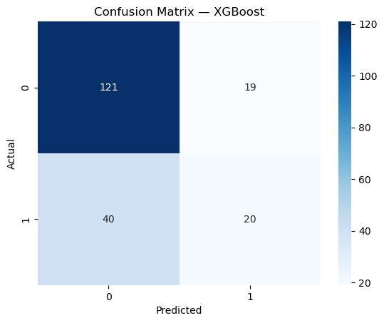

# 💳 Credit Risk Assessment System with Model Interpretability

A full-stack Machine Learning application designed to predict loan default risk using the German Credit Dataset. This project bridges the gap between complex model performance and human trust by integrating Explainable AI (XAI) via SHAP values, visualizing exactly how individual features contribute to a borrower's risk score.

## 🚀 Key Features

* **Production-Ready Pipeline:** End-to-end integration from raw data processing to a live web dashboard.
* **Model Interpretability:** Uses SHAP to provide local explanations for every prediction, ensuring transparency in automated credit decisions.
* **Full-Stack Architecture:** Decoupled system with a FastAPI backend and an interactive React.js frontend.
* **Automated Feature Alignment:** Employs a JSON-based schema to ensure training features perfectly match real-time API inputs.

## 📊 Model Performance & Evaluation

The system utilizes an optimized XGBoost Classifier. Evaluation was performed on a hold-out test set to ensure generalizability.

| Metric | Score | Note |
| :--- | :--- | :--- |
| **Accuracy** | **0.70** | Overall correctness of the model. |
| **Recall (Low Risk)** | **0.86** | Ability to identify reliable borrowers. |
| **Recall (High Risk)** | **0.33** | Ability to catch actual defaults. |

## Confusion Matrix Analysis

''

The matrix reveals a conservative lending approach, prioritizing the identification of low-risk candidates to maintain a high "Good" credit recall.

## 🛠️ Technical Stack

* **Machine Learning:** Python, XGBoost, SHAP.
* **Backend:** FastAPI, Pydantic, Uvicorn.
* **Frontend:** React.js, Recharts.


## 📂 Project Structure

```text
├── backend/    # FastAPI API and model inference logic
├── frontend/   # React.js UI and visualizations
├── models/     # Serialized XGBoost model (.pkl)
└── notebooks/  # EDA and SHAP development

## 🔗 Deployment Links

**Live Application:** https://credit-risk-ml-app.vercel.app/
